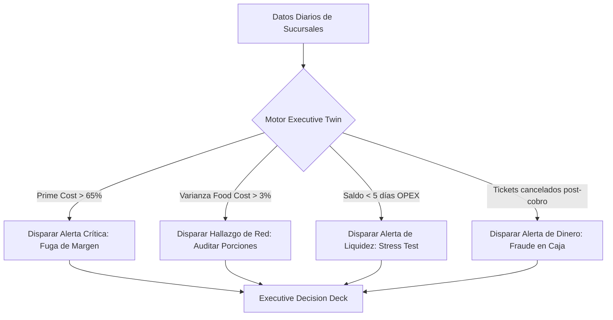

# Propuesta: Dirección Ejecutiva & Unit Economics para Pulso (Executive OS)

Fecha: 16 de septiembre de 2026. Estado: Propuesta para revisión; diseño alternativo a `app/dashboard/executive`.

---

## 1. Recomendación Ejecutiva

Transformar `/dashboard/executive` de un **"scroll de reportes apilados"** a un **"Cockpit de Decisiones y Capital" (Executive Operating Cockpit)** diseñado específicamente para el dueño, director general o socio operador de un grupo de 3 a 15 restaurantes en México.

El nuevo diseño abandona la sobrecarga de 7 secciones verticales inconexas (Morning Brief -> Chatbot -> 6 tarjetas -> Tabla de P&L de 15 columnas -> Gráfica de caja -> Predicciones -> Tendencias NOM) y reorganiza la pantalla alrededor de las tres preguntas existenciales del dueño restaurantero:

1. **¿Qué decisiones o bloqueos requieren mi intervención hoy para no fugar dinero?** (*Decision Deck & Morning Pulse*).
2. **¿Quién está ganando y quién está quemando margen en la red?** (*Unit Economics, Prime Cost <60% y Fugas Ocultas*).
3. **¿Tenemos suficiente oxígeno de caja para los próximos 14 días?** (*Liquidez real, nómina quincenal, IMSS día 17 y compromisos ineludibles*).

---

## 2. Diagnóstico de la Pantalla Actual (`app/dashboard/executive/page.tsx`)

### 2.1 Lo que existe hoy en código
La página actual integra componentes valiosos y servicios reales (`ExecutiveTwinEngine`, `MorningBriefService`, `CrossBranchService`, `PnLBranchTable`, `CashFlowProjectionWrapper`), pero su disposición visual y arquitectura de información presentan severas fricciones:

| Elemento Actual | Implementación en Código | Problema de Experiencia / Negocio |
|---|---|---|
| **Morning Brief** | `MorningBrief` (Server Component) | Muestra score 0-100 y prioridades en texto, pero es pasivo: no permite autorizar, resolver ni derivar con 1 clic. |
| **Copiloto Ejecutivo** | `ExecutiveCopilot` | Un cuadro de texto en blanco con un input "¿Qué quieres saber del twin?". Los dueños en campo o celular no quieren "chatear" desde cero; requieren simuladores de decisión con parámetros listos. |
| **KPI Hero Cards** | 6 tarjetas en grid de 3 columnas | Muestran números estáticos ("Salud", "Riesgo Op", "Consistencia"). No destacan el **Prime Cost** (la métrica madre de rentabilidad restaurantera) ni el dinero líquido neto. |
| **P&L Multi-Unidad** | `PnlBranchTable` | Es una tabla contable masiva de 12–15 columnas. Rompe el flujo visual de la pantalla ejecutiva y genera fatiga visual en pantallas de laptop o iPad. Pertenece a una vista detallada de Finanzas, no al dashboard ejecutivo. |
| **Flujo a 14 Días** | `CashFlowProjection` | Gráfica de barras aislada. No muestra claramente los hitos de nómina quincenal ni el pago al IMSS (día 17), que son las fechas de mayor estrés de caja en México. |
| **Predicciones & Tendencias** | `PredictionsPanel` + `ComplianceTrendChart` | Ocupan el fondo de la página tras un scroll kilométrico. Duplican información que ya reside en `/dashboard/branches` y `/dashboard/compliance`. |

### 2.2 Principales problemas detectados

1. **"Scroll de Fatiga" sin jerarquía:** El usuario debe desplazarse por más de 3,500 píxeles verticales para tener un panorama completo. No hay un resumen "above the fold" que permita evaluar la salud del grupo en menos de 45 segundos.
2. **Falta de Accionabilidad (Decision Gap):** La pantalla es predominantemente de lectura. Si una sucursal tiene un desvío crítico de inventario o una nómina requiere segunda firma, el dueño debe salir de la pantalla, buscar en el menú lateral y navegar a otro módulo.
3. **Desalineación con la estructura de "Comando de Red":**
   - `/dashboard` (En Vivo) cubre el turno de hoy (apertura a tiempo, frío NOM-251, horas pico, ventas en tiempo real).
   - `/dashboard/exceptions` (Excepciones & Riesgos) cubre el triage operativo (Dinero, Inocuidad, Abasto, Personal).
   - `/dashboard/branches` (Liga de Sucursales) cubre el ranking y la consistencia de red.
   - `/dashboard/executive` debe ser **la cabina del capital, la rentabilidad unitaria y las autorizaciones estratégicas**, no un duplicado de gráficas de compliance operativo.

---

## 3. Propuesta de Producto: "The Executive Operating Cockpit"

### 3.1 Los 3 Principios de Diseño
1. **La Regla de los 60 Segundos:** El dueño debe conocer el estado del dinero, los focos rojos y sus autorizaciones prioritarias sin hacer scroll.
2. **Acción en el Mismo Lugar:** Si el motor de inteligencia detecta una oportunidad o un riesgo financiero, la tarjeta ejecutiva ofrece el botón directo de resolución (`[Autorizar Dispersión]`, `[Traspasar Insumo]`, `[Auditar Merma]`).
3. **Unit Economics sobre Contabilidad Tradicional:** La gastronomía organizada se rige por el **Prime Cost** (Alimentos + Mano de Obra ≤ 60%) y el **EBITDA Operativo**. Esas son las anclas visibles de la rentabilidad.

---

## 4. Arquitectura de Información Alternativa

Proponemos una estructura organizada en un **Cockpit Ejecutivo de Alta Densidad** estructurado en 3 Vistas de Trabajo (pestañas o modos de decisión fluidos con URL sync `?view=cockpit|economics|liquidity`):

```
┌──────────────────────────────────────────────────────────────────────────────────────────────────┐
│  PULSO DIRECCIÓN & P&L                   Grupo Gastronómico del Norte · 5 sucursales · Sep 2026   │
├──────────────────────────────────────────────────────────────────────────────────────────────────┤
│  [  1. Despacho & Decisiones  ]      [  2. Unit Economics & Prime Cost  ]      [  3. Oxígeno & Flujo 14D  ]   │
└──────────────────────────────────────────────────────────────────────────────────────────────────┘
```

---

### VISTA 1: Despacho & Decisiones (La Rutina Diaria del Dueño)

El 80% de las visitas al dashboard ejecutivo ocurren aquí. Diseñada para responder: *"¿Puedo operar tranquilo hoy o qué está bloqueado?"*

#### Bloque A: Vital Signs Bar (4 Indicadores Clave de Alta Jerarquía)
Una sola franja superior limpia, con tipografía Geist Display y tonalidad semafórica sobria:
1. **Salud de Red (Twin Score):** `88/100` (`+3 pts vs ayer` · Desviación controlada).
2. **Venta Neta del Mes:** `$4,820,000 MXN` (`96% de la meta` · Run-rate proyectado `$5.1M`).
3. **Prime Cost Consolidado:** `57.8%` (✅ Saludable · Alimentos `29.4%` + Nómina `28.4%` · Meta: `<60%`).
4. **Caja Libre Proyectada (14d):** `$648,000 MXN` (Colchón de seguridad cubierto tras nómina e impuestos).

#### Bloque B: Executive Decision Deck (La Cola de Autorizaciones y Arbitrajes)
En lugar de texto pasivo, tarjetas interactivas de decisión con impacto económico directo en pesos mexicanos (MXN):

```
┌──────────────────────────────────────────────────────────────────────────────────────────────────┐
│  DECISIONES & AUTORIZACIONES PENDIENTES (3 casos requieren tu firma hoy)                        │
├──────────────────────────────────────────────────────────────────────────────────────────────────┤
│  🔴 Dispersión de Nómina Quincenal                                      Impacto: $342,800 MXN    │
│     Cierre de nómina 48 colaboradores en 5 sucursales. Sin horas extra excesivas detectadas.      │
│     [ Revisar Desglose ]   [ Autorizar Dispersión SPEI ]                                        │
├──────────────────────────────────────────────────────────────────────────────────────────────────┤
│  🟡 Arbitraje de Abasto Multi-Unidad                                     Ahorro: $18,400 MXN     │
│     Sucursal Valle tiene 85 kg de Arrachera Marinada (sobre-stock 14d, riesgo caducidad).        │
│     Sucursal Cumbres tiene desabasto previsto para el viernes de quincena.                       │
│     [ Aprobar Traspaso Valle → Cumbres por WhatsApp ]                                           │
├──────────────────────────────────────────────────────────────────────────────────────────────────┤
│  🔴 Alerta de Fuga en Caja / Cancelaciones Post-Cobro                    Riesgo: $6,850 MXN      │
│     Sucursal Roma: 4 tickets cobrados con tarjeta cancelados en POS sin voucher de devolución.   │
│     [ Solicitar Explicación a Gerente ]   [ Ver Expediente ]                                    │
└──────────────────────────────────────────────────────────────────────────────────────────────────┘
```

#### Bloque C: Copiloto Estratégico Proactivo (Virtual Board Member)
En lugar de un input vacío, el copiloto presenta **3 Simulaciones de Alto Impacto** generadas por el `ExecutiveTwinEngine` para el mes en curso:
- 💡 **Simulación 1:** *"Si estandarizamos las porciones de salsa y proteína de Cumbres al nivel de San Pedro, el EBITDA del grupo sube $46,000 MXN/mes."* `[Ver simulación]`
- 💡 **Simulación 2:** *"Aumento inminente de 7% en precio de carne de res por proveedor San Juan. Impacto proyectado en Prime Cost: +1.8 puntos."* `[Ver plan de mitigación]`
- 💡 **Pregunta abierta al Twin:** Barra de consulta rápida con respuestas auditables vinculadas a la base de datos.

---

### VISTA 2: Unit Economics & Prime Cost (Rentabilidad Real por Tienda)

Diseñada para la junta semanal de socios o dirección de operaciones. Responde: *"¿Dónde estamos ganando y dónde estamos perdiendo dinero?"*

#### Bloque A: Prime Cost Stack por Sucursal (Comparador Visual de Eficiencia)
En vez de una tabla aburrida, un gráfico de barras apiladas proporcionales que revela la anatomía del costo de cada restaurante:

```
Meta de la Cadena: Prime Cost < 60%
────────────────────────────────────────────────────────────────────────
San Pedro    [ Alimentos 26.2% ][ Mano Obra 27.1% ] ── 53.3%  ✅ Estrella
Valle        [ Alimentos 28.5% ][ Mano Obra 28.0% ] ── 56.5%  ✅ Estable
Centro       [ Alimentos 30.1% ][ Mano Obra 29.4% ] ── 59.5%  🟡 Al Límite
Cumbres      [ Alimentos 33.8% ][ Mano Obra 31.2% ] ── 65.0%  🔴 Fuga de Margen (-5.0 pts)
Contry       [ Alimentos 36.4% ][ Mano Obra 32.1% ] ── 68.5%  🔴 Fuga Crítica (-8.5 pts)
────────────────────────────────────────────────────────────────────────
```

#### Bloque B: Radar de Fugas de Margen (Leakage Breakdown)
Identificación con rigor de causa-raíz de por qué una sucursal pierde dinero:
- **Merma de alimentos no registrada:** Desviación entre inventario teórico y conteo real (`ExecutiveReportService`).
- **Sobrecosto de horas extra y retardo:** Desviación de nómina sobre el presupuesto del turno.
- **Descuadre de caja y comisiones no auditadas:** Diferencias entre cortes POS y terminales TPV.

#### Bloque C: Cascada de P&L Operativo Resumido (EBITDA de Red)
Una tarjeta colapsable con la cascada financiera del grupo:
- **Ventas Totales:** $4,820,000 MXN (100%)
- **(-) Costo de Ventas / Insumos (COGS):** $1,417,080 MXN (29.4%)
- **(=) Margen Bruto:** $3,402,920 MXN (70.6%)
- **(-) Mano de Obra Operativa:** $1,368,880 MXN (28.4%)
- **(=) Margen Contributivo / Prime Margin:** $2,034,040 MXN (42.2%)
- **(-) Gastos Operativos de Tienda (Rentas, Servicios, Mantenimiento):** $867,600 MXN (18.0%)
- **(=) EBITDA Operativo de Tiendas:** $1,166,440 MXN (24.2%)
- *Botón:* `[ Ver P&L Detallado por Sucursal con Auditoría de Procedencia ]` (abre drawer lateral sin salir de la vista).

---

### VISTA 3: Oxígeno & Flujo a 14 Días (Control de Liquidez y Compromisos)

Diseñada para evitar sorpresas bancarias. En México, los restaurantes colapsan por flujo, no por ventas. Responde: *"¿Llegamos holgados a la próxima nómina y al pago del IMSS?"*

#### Bloque A: Calendario de Hitos Críticos de Salida
1. **Día 15 (Viernes):** Dispersión de Nómina Quincenal (`-$342,800 MXN`).
2. **Día 17 (Lunes):** Pago de Cuotas Obrero-Patronales IMSS/Infonavit (`-$88,400 MXN` · Innegociable, riesgo de congelamiento de cuentas).
3. **Día 19 (Miércoles):** Proveedores Clave de Carne y Perecederos (`-$145,000 MXN` · Mantener línea de crédito de 15 días).
4. **Día 30 / 1ro:** Rentas de Locales Comerciales (`-$210,000 MXN` · 5 plazas comerciales).

#### Bloque B: Proyección Interactiva de Saldo Mínimo (Lowest Cash Point)
Gráfica limpia de área y barras que muestra:
- Saldo inicial en banco.
- Entradas proyectadas de ventas diarias (basadas en histórico de días hábiles y fines de semana).
- Salidas confirmadas y comprometidas.
- **Punto Crítico de Caja (Stress Test):** Muestra si el saldo en algún momento del ciclo toca el fondo de reserva de la empresa (ej. `$200,000 MXN`).

#### Bloque C: Simulador de Reprogramación de Pagos
Si el saldo proyectado toca zona de peligro, el director puede simular con un deslizador:
*"¿Qué pasa si diferimos el 40% del lote de proveedores de abarrotes del día 19 al día 24?"*
El sistema recalcula el impacto en liquidez en tiempo real sin modificar los datos de la base de datos hasta que se autorice.

---

## 5. Comparativa: Estado Actual vs Propuesta Alternativa

| Criterio | Estado Actual (`/dashboard/executive`) | Propuesta Alternativa (Cockpit Ejecutivo) |
|---|---|---|
| **Disposición Visual** | Scroll vertical continuo de 7 niveles | Cockpit con 3 vistas fluidas (`Despacho`, `Unit Economics`, `Flujo 14D`) |
| **Tiempo de Diagnóstico** | 3 a 5 minutos buscando entre tablas y gráficas | **Menos de 60 segundos** en la vista de Despacho |
| **Accionabilidad** | Pasiva / Informativa (solo lectura) | **Decision Deck interactivo** con botones de acción y montos en MXN |
| **Métrica Central** | Salud abstracta y cumplimiento NOM | **Prime Cost (Comida + Nómina < 60%)** y EBITDA Operativo |
| **Interacción con IA** | Chatbot genérico de texto en blanco | **Simulaciones pre-calculadas de EBITDA y Abasto** |
| **Manejo del P&L** | Tabla masiva de 15 columnas en la pantalla principal | **Visualización de Prime Cost apilado + Drawer auditado** |
| **Control de Caja** | Gráfica de barras genérica de 14 días | **Hitos específicos (Nómina 15/30, IMSS día 17, Rentas)** con Stress Test |

---

## 6. Arquitectura Técnica y Reutilización de Código

Esta propuesta **no desecha el trabajo ya realizado**; por el contrario, aprovecha con precisión los motores existentes en el repositorio:

1. **`ExecutiveTwinEngine` (`lib/services/executive-twin-engine.ts`):** Aporta `healthScore`, `driftScore`, `projectedCashFlowCents`, `liquidityRisk`, `upcomingObligationsCents` y `executiveState`.
2. **`CrossBranchService.getQSRRanking` & `detectNetworkAnomalies`:** Proporcionan directamente el cálculo de `primeCostPercent`, `foodCostPercent`, `laborCostPercent` y las anomalías de red ya implementadas en el Sprint actual.
3. **`MorningBriefService` (`lib/services/morning-brief-service.ts`):** Proporciona las prioridades de impacto matutino (`BriefPriority`) que alimentan el Decision Deck.
4. **`CashFlowService` (`lib/services/cash-flow-service.ts`):** Alimenta el calendario de hitos críticos y la proyección de tesorería a 14 días.
5. **`GroupExceptionsService` (`lib/services/group-exceptions-service.ts`):** Aporta los vínculos directos de resolución para las alertas de dinero y personal.

---

### Fase 1: Rediseño de Navegación y Cabecera Ejecutiva (Completada)
- Implementación de la barra superior de signos vitales (Salud, Venta del Mes, Prime Cost Consolidado, Caja Libre 14d).
- Selector de vistas fluido (`Despacho & Decisiones` | `Unit Economics` | `Oxígeno 14D`) sincronizado vía URL search params (`?view=`).

### Fase 2: Implementación del Executive Decision Deck & Copiloto (Completada)
- Transformación del texto del brief en tarjetas accionables enriquecidas con dinero en riesgo y botones de resolución en un clic.
- Sustitución del chat pasivo por 3 simulaciones estratégicas de alto impacto (EBITDA, inflación en carnes, capacidad de expansión).

### Fase 3: Visualizador de Prime Cost & Unit Economics (Completada)
- Componente `PrimeCostStackCard` para comparar las 3 a 15 sucursales mediante barras apiladas (Alimentos % + Mano de Obra %) frente al umbral del 60%.
- Cascada financiera de EBITDA y migración de la tabla detallada de P&L hacia un Drawer lateral (`Sheet`) bajo demanda.

### Fase 4: Proyector de Caja con Hitos IMSS/Nómina (Completada)
- Gráfica interactiva de tesorería a 14 días con prueba de estrés de saldo mínimo (*Lowest Cash Point*).
- Desglose de los 4 hitos ineludibles de la gastronomía en México (Nómina 15/30, IMSS día 17, Proveedores de perecederos y Rentas).

---

## 8. Experiencia por Rol y Dispositivo

En cadenas de 3 a 15 restaurantes, la información ejecutiva se consume en contextos radicalmente distintos:

### 8.1 Dueño / Socio Fundador (Mobile & Tablet First — Rutina de 3 Minutos)
- **Momento:** 7:30 AM antes de iniciar la jornada o 3:00 PM entre servicios.
- **Dispositivo habitual:** Teléfono móvil o iPad.
- **Objetivo:** Certeza y desbloqueo. No busca analizar micro-datos contables; necesita responder:
  - *¿Las tiendas abrieron a tiempo y el personal está completo?*
  - *¿Hay alguna alerta roja que amenace la comida o el dinero?*
  - *¿Debo autorizar nómina o pagos a proveedores hoy?*
- **Diseño adaptado:** Vista **Despacho & Decisiones** por defecto. Tipografía grande, tarjetas táctiles de alta superficie y botones de acción rápida con deep-links directos a WhatsApp o al flujo de autorización.

### 8.2 Director de Operaciones / Gerente de Red (Desktop — Junta de Resultados)
- **Momento:** Lunes de análisis semanal o visitas de supervisión en campo.
- **Dispositivo habitual:** Laptop / Desktop en oficina o trinchera.
- **Objetivo:** Consistencia y disciplina multi-unidad. Detectar varianzas entre tiendas que operan con la misma carta.
- **Diseño adaptado:** Vista **Unit Economics & Prime Cost**. Comparador visual de barras apiladas, identificación de la "Sucursal Estrella" (benchmark) y causas de fuga de margen (merma de arrachera, sobrecosto de cuadrantes de cocina).

### 8.3 Director Financiero / Contralor (CFO / Despacho Contable)
- **Momento:** Cierres quincenales (días 14 y 29) y calendario fiscal (día 17).
- **Dispositivo habitual:** Monitor amplio de escritorio.
- **Objetivo:** Oxígeno de caja, suficiencia bancaria y auditoría contable.
- **Diseño adaptado:** Vista **Oxígeno & Flujo 14D** para stress test de liquidez y apertura del **P&L Audit Drawer** para verificar la procedencia de cada línea financiera (datos medidos vs estimados).

---

## 9. Tratamiento de la Calidad de Datos y Procedencia (Data Provenance)

Un problema habitual en restaurantes de 3 a 15 sucursales es la asincronía en la captura: una tienda hace su corte a las 2:00 AM, otra no ha subido el inventario físico semanal y una tercera tiene facturas de proveedores pendientes de timbrar.

Pulso implementa una estricta política de **degradación elegante y procedencia visible**:

1. **Nunca inventar datos con ceros:**
   - Si una sucursal no ha realizado su inventario físico de cierre de mes, el sistema **no asume merma cero**. Muestra la etiqueta `NO_DATA` con una advertencia en amarillo (`‡`), evitando que el dueño crea falsamente que la tienda es 100% eficiente.
2. **Clasificación de procedencia en cuatro niveles:**
   - `MEASURED` (Medido): Proviene de un registro inmutable verificado (ej. corte de caja POS cerrado, factura CFDI timbrada, dispersión bancaria confirmada).
   - `DERIVED` (Derivado †): Calculado a partir de fórmulas deterministas sobre datos medidos (ej. Prime Cost = Food Cost + Labor Cost).
   - `ESTIMATED` (Estimado ‡): Basado en tarifas comerciales configuradas o proyecciones históricas (ej. comisiones de tarjeta por tasa pactada cuando falta el reporte de Clip o banco).
   - `SECTOR_DEFAULT` (Referencia *): Benchmarks de la industria (ej. meta de 60% de Prime Cost o merma estándar del 2.5%).
3. **Cálculo de Prime Cost con datos faltantes:**
   - Si una sucursal tiene venta registrada pero no ha cerrado nómina, el sistema utiliza el costo presupuestado del turno clasificándolo como `ESTIMATED` para no romper el comparador de red, pero alerta al director en el Decision Deck para exigir el cierre de asistencia al gerente.

---

## 10. Invariantes de Negocio y Reglas de Decisión del Twin

El motor del `ExecutiveTwinEngine` evalúa continuamente los datos operacionales frente a los estándares de la industria restaurantera mexicana:



1. **Regla de Oro del Prime Cost ($\le 60\%$):**
   - Si el costo combinado de alimentos y mano de obra supera el 60.0%, la tarjeta entra en estado de advertencia (`warning`).
   - Si supera el 65.0%, se clasifica como `CRITICAL` (alerta de viabilidad económica) y se genera una tarjeta prioritaria en el Decision Deck.
2. **Detección de Desviaciones entre Sucursales Hermanas ($\Delta > 3.0\%$):**
   - Si dos tiendas con el mismo menú presentan una diferencia mayor a 3 puntos porcentuales en Food Cost, el sistema aísla la causa (desperdicio en cocina, merma de proteínas o porcionamiento incorrecto) y propone la acción de mitigación.
3. **Colchón Mínimo de Seguridad en Caja (5 días de OPEX):**
   - El sistema calcula el costo operativo diario promedio del grupo. Si la curva de liquidez proyectada a 14 días desciende por debajo de 5 días de operación, se bloquean gastos discrecionales y se sugiere la reprogramación de pagos no esenciales.
4. **Protección Fiscal Innegociable (Día 17 del IMSS):**
   - Las cuotas obrero-patronales del IMSS y amortizaciones de Infonavit se marcan con prioridad absoluta (`INNEGOCIABLE`) para evitar bloqueos de cuentas bancarias y requerimientos del SAT.

---

## 11. Métricas de Éxito y Criterios de Aceptación

El rediseño del Cockpit Ejecutivo se evalúa contra las siguientes métricas de producto:

| Métrica | Meta Cuantitativa | Método de Medición |
|---|---|---|
| **Tiempo de Diagnóstico (Time-to-Insight)** | $< 60$ segundos | Tiempo transcurrido desde la carga de la página hasta que el usuario identifica los focos rojos del grupo. |
| **Tasa de Resolución de Prioridades** | $> 80\%$ en el día | Decisiones del Decision Deck autorizadas o delegadas antes de las 18:00 hrs. |
| **Estabilidad Visual (Cumulative Layout Shift)** | $\text{CLS} < 0.05$ | Carga con skeletons granulares y Server Components en Next.js. |
| **Adopción de Vistas Especializadas** | $> 40\%$ de visitas | Usuarios alternando activamente hacia *Unit Economics* y *Oxígeno 14D* para análisis profundo. |
| **Reducción de Divergencias Contables** | $0\%$ discrepancias | Una sola fuente de verdad matemática entre el P&L detallado, el ranking QSR y las tarjetas de la cabecera. |

