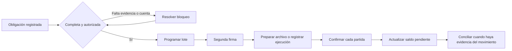
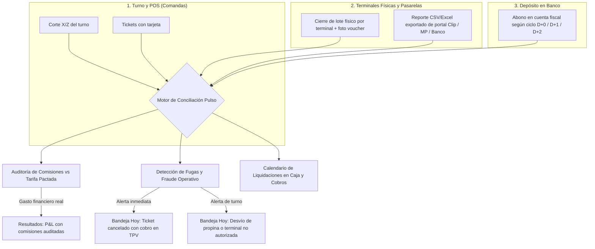

# Propuesta: Finanzas operativas para Pulso

Fecha: 15 de septiembre de 2026. Estado: propuesta para revisión; no implementada.

## Recomendación

Organizar Finanzas alrededor del ciclo diario del dinero: **revisar pendientes → registrar y autorizar → programar y confirmar pagos → explicar resultados → cerrar el período**.

La alternativa conserva la identidad de Pulso y los servicios existentes. Cambia la arquitectura de información, las tareas que se pueden completar desde cada pantalla y la forma de mostrar la confianza de los datos.

Supuesto de trabajo: replanteamiento funcional y de experiencia para un dueño o administrador de 3–15 sucursales; gerentes con alcance de su sucursal. La preferencia entre rediseño integral y cambio principalmente visual queda por confirmar. Este documento propone el integral.

## Alcance de la investigación

Recorrido de las 14 páginas de `app/dashboard/finance`, sus componentes principales, contratos de datos y servicios centrales; revisión de rutas API relevantes, esquemas de finanzas y tesorería, navegación y pruebas relacionadas. Se contrastó con PRODUCT.md y DESIGN.md.

La revisión fue estática. No se inspeccionó la aplicación renderizada, no se consultaron datos de producción y no se ejecutaron pruebas. Los hallazgos describen el código revisado y sus consecuencias; no constituyen una auditoría contable, fiscal o una certificación de seguridad. Los documentos históricos de crítica se usaron como contexto: varias observaciones ya están corregidas en el código actual.

## Qué existe y dónde encaja

Rutas relativas a `/dashboard/finance`:

| Pantalla actual | Función observada | Destino propuesto |
|---|---|---|
| `/` | Indicadores, resultados por sucursal, atención, flujo y 12 accesos | Hoy + Resultados |
| `/expenses` | Captura, evidencia, aprobación/rechazo, centro de costo y presupuesto | Gastos |
| `/petty-cash` | Fondos, consolidado por sucursal y movimientos | Gastos → Caja chica |
| `/payables` | Facturas y gastos autorizados pendientes, vencimientos, antigüedad y discrepancias | Pagos → Pendientes |
| `/treasury` | Corridas de pago y contratos recurrentes | Pagos → Programación; recurrentes en Gastos |
| `/treasury/runs/[id]` | Partidas y transición de estados de una corrida | Pagos → Detalle del lote |
| `/cash-flow` | Proyección, saldo inicial, supuestos, compromisos y reprogramación | Caja y cobros → Proyección |
| `/payees` | Catálogo de contrapartes de gastos | Configuración → Beneficiarios |
| `/payee-bank-accounts` | Registro y verificación de cuentas de contrapartes | Ficha del beneficiario |
| `/supplier-bank-accounts` | Registro y verificación de cuentas de proveedores | Ficha del beneficiario |
| `/labor-cost` | Costo laboral por sucursal, cobertura, fuente y objetivo | Resultados → Personal |
| `/commissions` | Costos por canal, tarifas y liquidaciones | Resultados → Canales; conciliación TPV y comisiones en Caja y cobros |
| `/control-interno` | Bitácora, excepciones, autorizaciones y matriz | Hoy + Cierre y control; matriz en Configuración |
| `/fiscal` | Validación de facturas y formulario de timbrado de nómina | Cierre y control → Documentos |

El módulo real también alcanza `/dashboard/sales` (corte diario de ventas, varianza de efectivo y depósito TPV), mapeo POS, presupuestos, control gerencial y objetivos de operación. Compras aporta órdenes, recepciones y facturas; RH aporta contratos, asistencia y nómina; inventario aporta costos y merma. La navegación propuesta debe integrar estos puntos sin duplicar sus registros.

## Diagnóstico

### Bases que conviene conservar

- **Resultado por sucursal con procedencia.** El P&L distingue datos medidos, derivados, estimados, referencias sectoriales y datos faltantes; incluye merma, caja chica y comisiones. Ya dispone de exportación CSV.
- **Tesorería con controles reales.** Hay transiciones de estado, separación entre quien prepara y quien aprueba, verificación de cuentas y referencias a la cuenta seleccionada en las partidas.
- **Flujo con supuestos explícitos.** El saldo inicial es capturado; las entradas pueden estimarse por día de la semana; los contratos recurrentes proyectados se distinguen de obligaciones capturadas.
- **Conexión con la operación.** El resultado utiliza ventas, costos de insumos, personal y gastos. Esta conexión es el valor específico de Pulso.
- **Control operativo existente.** Caja chica consolidada, aprobaciones, presupuestos, excepciones y períodos financieros no necesitan presentarse como funciones por construir desde cero.
- **Capa base de ventas y TPV.** `daily_sales_cuts` ya separa ventas en efectivo y tarjeta (`cardSales`), captura depósito de terminal (`tpvDepositCents`) y comisión (`commissionCents`), y aísla la varianza TPV de la de efectivo para evitar que un faltante de caja se enmascare tras el rezago de liquidación bancaria.

Fuentes: [P&L y procedencia](../lib/services/pnl-types.ts), [servicio de resultados](../lib/services/pnl-service.ts), [tesorería](../lib/services/treasury-service.ts), [flujo](../lib/services/cash-flow-service.ts).

### Problemas de experiencia

1. **La navegación expone muchas piezas del sistema.** El menú lateral y los accesos de la portada ofrecen recorridos distintos. El usuario necesita saber si una tarea pertenece a gastos, cuentas por pagar, tesorería, contrapartes o control interno.
2. **La portada reúne información, pero la resolución sigue fuera.** El panel de atención ya existe. Sus enlaces llevan a páginas generales; no transmiten el identificador del caso para abrir directamente su expediente.
3. **El contexto cambia entre bloques.** El P&L compara sucursales independientemente del selector global; tesorería consulta a nivel de empresa; otros bloques siguen la sucursal elegida. Son alcances potencialmente válidos, pero deben declararse y controlarse expresamente.
4. **El análisis histórico y la operación futura comparten controles ambiguos.** El rango del resultado mensual no debería parecer que controla también las obligaciones abiertas o los próximos 30 días de caja.
5. **Los catálogos interrumpen las tareas.** Proveedores y contrapartes tienen cuentas en pantallas separadas. Conviene una ficha visible unificada que conserve sus identidades y permisos de origen.
6. **La procedencia exige demasiado descifrado.** Existe información rica sobre cobertura y estimaciones. Puede convertirse en una tarea concreta: qué falta capturar, en qué sucursal y cómo cambia la confianza del resultado.
7. **La conciliación con tarjeta es un punto ciego a nivel transacción y lote.** El corte solo captura totales agregados por turno. Al no confrontar los vouchers físicos de las terminales ni los reportes descargables de Clip, Mercado Pago o bancos, el restaurante no puede auditar si le cobraron la comisión pactada, si un mesero cobró con una terminal ajena, o si un ticket se canceló en el POS después de haberse cobrado exitosamente con tarjeta.

Fuentes: [portada](../app/dashboard/finance/page.tsx), [menú](../components/app-sidebar.tsx), [atención](../components/finance/money-attention-panel.tsx), [tabla de resultados](../components/finance/pnl-branch-table.tsx), [tesorería UI](../components/finance/treasury-dashboard.tsx).

### Hallazgos técnicos que condicionan el rediseño

| Prioridad | Evidencia en el código | Consecuencia y tratamiento |
|---|---|---|
| Alta | `MoneyAttentionPanel` captura `dateRange` dentro de un callback cuyas dependencias solo incluyen `branchId` | Cambiar únicamente el período puede relanzar la consulta con el rango anterior. Corregir y verificar el contrato temporal de cada fuente. |
| Alta | El resumen de flujo envía fechas, pero `/api/finance/cash-flow` lee horizonte, sucursal y recurrentes; no consume esas fechas | La interfaz sugiere un filtro que no aplica. Separar explícitamente período histórico y horizonte futuro. El resumen también tiene la dependencia incompleta anterior. |
| Alta | Atención calcula discrepancias con los cortes recibidos; `/api/sales/cuts` devuelve por defecto 100 registros paginados | Puede omitir casos fuera de la página consultada. Crear agregados y paginación propios de la bandeja. No presentar la muestra como total. |
| Alta | Al completar una corrida, el servicio marca todas sus facturas y gastos como pagados. Las partidas no tienen un estado individual de liquidación | No permite expresar correctamente una transferencia fallida o un lote liquidado parcialmente. Añadir confirmación por partida antes de ofrecer conciliación completa. |
| Alta | `closeFinancialPeriod` captura un fallo de `freezePnLPeriod`, registra una advertencia y continúa al estado CLOSED | El cierre puede existir sin la fotografía de resultados esperada. Cerrar solo cuando el resultado quede preservado, con recuperación de fallos e idempotencia. |
| Media | Los badges de portada omiten conteos cuando falla su fuente, sin presentar estado de error en el acceso | La ausencia de badge puede confundirse con ausencia de pendientes. Usar estados disponible, parcial y no disponible. |
| Media | Atención envía fechas a `/api/expenses`, pero el GET revisado no las consume | Una misma lista mezcla criterios temporales. Definir “pendientes abiertos al día de hoy” independientemente del mes del P&L. |
| Media | `daily_sales_cuts` registra `commission_cents` y `tpv_deposit_cents` como agregados opcionales por corte; no existe desglose por terminal física ni importador de reportes de pasarela | Limita la detección de fugas (cancelaciones post-cobro, propinas infladas) y la auditoría de comisiones a comparaciones globales. Crear entidad ligera de lotes/terminales e importador de reportes CSV/Excel de pasarelas. |

Anclas: [dependencias de atención](../components/finance/money-attention-panel.tsx#L227), [resumen de flujo](../components/finance/cash-flow-summary-card.tsx#L64), [API de flujo](../app/api/finance/cash-flow/route.ts), [cortes paginados](../app/api/sales/cuts/route.ts), [confirmación de corrida](../lib/services/treasury-service.ts#L871), [partidas](../lib/db/schema/treasury.ts), [cierre](../lib/services/financial-period-service.ts#L49).

El archivo de dispersión disponible es un CSV denominado `SPEI_CSV`. Generarlo no demuestra una transferencia ejecutada ni compatibilidad con cualquier portal bancario. El nuevo producto debe distinguir archivo preparado, pago confirmado y movimiento conciliado.

## Propuesta de producto

Nombre visible: **Finanzas**. Descripción: **Control del dinero de tu operación**.

### Seis espacios de trabajo

| Espacio | Pregunta que resuelve | Contenido y acción principal |
|---|---|---|
| **Hoy** | ¿Qué necesita atención? | Bandeja de aprobaciones, vencimientos, diferencias, cancelaciones sospechosas y bloqueos. Abrir y resolver un caso. |
| **Gastos** | ¿Qué se gastó y qué viene? | Gastos, recurrentes, caja chica y vínculo con presupuesto. Registrar una vez y seguir su avance. |
| **Pagos** | ¿Qué podemos pagar y qué falta? | Deuda, partidas elegibles, programación, doble firma y seguimiento. Preparar un lote. |
| **Caja y cobros** | ¿Con cuánto contamos y qué falta recibir? | Saldos declarados, proyección, cortes, conciliación TPV/pasarelas y liquidaciones bancarias. Revisar diferencias o actualizar saldo. |
| **Resultados** | ¿Dónde ganamos y qué lo explica? | Comparación de sucursales, insumos, merma, personal, comisiones auditadas y gastos. Investigar una desviación. |
| **Cierre y control** | ¿Está completo y respaldado el período? | Checklist de cierre, documentos, excepciones, bitácora y resultado congelado. Completar y cerrar. |

**Configuración** queda en un acceso secundario: beneficiarios, cuentas, tarifas, reglas de autorización, centros de costo y objetivos. Se conserva un único editor para cada configuración existente.

“Cobros” se refiere aquí a cortes de turno, conciliación de terminales (TPV), liquidaciones de pasarelas y depósitos bancarios de canales existentes. Dado que las sucursales operan sin integraciones directas por API con bancos ni terminales, la conciliación se apoya en los artefactos reales de la operación: cortes de POS, vouchers físicos y reportes descargables de las plataformas.

### Pantalla inicial: Hoy

En escritorio, una lista de pendientes ocupa la zona principal. Un panel lateral muestra el caso seleccionado. Arriba solo aparecen alcance, fecha de consulta, actualización y una síntesis compacta de pendientes por tipo. El acceso al resultado mensual queda visible en la navegación.

Cada pendiente muestra:

- Motivo: aprobar gasto, verificar cuenta, revisar diferencia, completar fecha o preparar pago.
- Sucursal, contraparte, importe y antigüedad/vencimiento.
- Responsable o rol que puede actuar; bloqueo concreto cuando corresponda.
- Acción que abre el expediente con documento, evidencia, historial y siguiente paso.

Un caso puede tener varios motivos, pero debe identificarse por su registro origen para evitar duplicarlo como gasto atrasado y excepción independiente.

**Ejemplo ficticio:** “Gas · Centro · $8,400 · vence mañana · espera aprobación”. Al abrirlo se consulta evidencia, presupuesto y beneficiario; al aprobarlo pasa a disponible para programación. La acción siguiente queda visible en ese mismo expediente.

### Pagos: de la obligación al resultado confirmado

Este es un flujo propuesto. Los pasos de confirmación individual y conciliación necesitan ampliar el modelo actual.

El usuario selecciona obligaciones elegibles y ve fecha, importe, beneficiario y cuenta antes de solicitar firma. Las partidas bloqueadas quedan visibles con su razón. La descarga indica cuánto incluye y cuánto excluye. Un rechazo bancario mantiene el importe pendiente; una repetición de la confirmación no vuelve a descontarlo.

La aprobación operativa del gasto y la autorización del lote son pasos diferentes. Se muestran como hitos dentro del mismo expediente y mantienen sus permisos.

### Resultados: comparar y explicar

Una fila por sucursal, con ventas, costo de insumos, personal, otros egresos, resultado operativo y calidad de datos. Al seleccionar una sucursal, se abre el desglose y sus registros de origen.

El encabezado declara si la base es venta neta medida, neta estimada o bruta. Diferenciar margen después de insumos y personal de resultado operativo. Mantener la aritmética del servicio existente; acordar y verificar definiciones antes de modificar cálculos.

La calidad se expresa con texto y detalle: “asistencia parcial”, “comisión estimada por tarifa” o “faltan inventarios”. Nunca convertir datos faltantes en cero ni declarar una causa a partir de una simple correlación. Mostrar “contribuye a la variación” cuando el desglose lo sustente.

### Caja y cobros: liquidez con procedencia visible

Separar tres capas: saldo capturado y fecha, compromisos registrados y entradas/salidas estimadas. Mostrar el punto de menor saldo del horizonte solo si los datos permiten calcularlo.

La vista de grupo distingue fondos corporativos y sucursales. Un saldo corporativo usado como respaldo no se suma nuevamente por cada sucursal. Los cortes, comisiones y liquidaciones se conectan por sus referencias disponibles, sin asumir que vender equivale a haber recibido el depósito.

La reprogramación real de gastos ya existe. Un simulador futuro debe permitir explorar cambios antes de guardarlos y declarar su impacto, sin modificar automáticamente los vencimientos.

### Cobros con tarjeta, conciliación TPV y control de fugas (Operación sin integraciones directas)

En cadenas restauranteras y de hospitalidad en México (3 a 15 sucursales), entre el 60% y el 85% de las ventas se cobran con tarjeta mediante terminales punto de venta (TPV). El parque de terminales es heterogéneo y **no cuenta con integraciones directas por API**: conviven agregadores móviles (Clip, Mercado Pago Point, Stripe Terminal) con terminales bancarias fijas e inalámbricas de adquirentes tradicionales (BBVA, Banorte, Santander). 

El sistema POS (Soft Restaurant, Aloha, Micros, etc.) registra los tickets como cobrados con tarjeta, pero no tiene comunicación con el hardware de cobro. Sin un control riguroso, este desacoplamiento genera dos problemas críticos: **comisiones bancarias no auditadas** (cobros excesivos no detectados) y **fugas operativas** (cancelaciones de comandas ya cobradas, alteración de propinas y terminales ajenas).

#### Conciliación a tres bandas a partir de artefactos reales

Dado que no existen APIs en vivo, la conciliación automática cruza los tres artefactos que el restaurante produce cotidianamente:

1. **Banda 1 (POS / Turno):** Venta con tarjeta según corte de turno (`daily_sales_cuts.card_sales`) y tickets individuales cerrados con tarjeta en `sales_entries`.
2. **Banda 2 (Terminales y Pasarelas):**
   - *En cada cierre de turno:* El gerente captura en Pulso el total de venta y propinas de cada terminal física asignada a la sucursal, adjuntando la fotografía del voucher de cierre de lote (vía Web o WhatsApp, reutilizando el canal de evidencias del sistema).
   - *Periódica (semanal o mensual):* Carga del reporte CSV/Excel descargado del portal web de Clip, Mercado Pago, Stripe o del portal de adquirencia bancaria, procesado mediante plantillas de mapeo configurables (`pos_mapping_templates` adaptado a pasarelas).
3. **Banda 3 (Banco / Depósito):** Cruce con el abono neto que ingresa a la cuenta bancaria (`tpv_deposit_cents`), considerando las ventanas de liquidación de la pasarela:
   - Agregadores: D+0 (con sobrecosto opcional) o D+1 hábil.
   - Terminales bancarias: D+1 en días hábiles; las ventas de viernes, sábado y domingo se agrupan y dispersan juntas el lunes o martes.

#### Auditoría matemática de comisiones y costo financiero

Pulso permite configurar las condiciones comerciales pactadas por sucursal y pasarela:
- **Tasa MDR base:** Expresada en puntos base (`tasaBps`), diferenciando tarifas de débito (ej. 160–180 bps) y crédito (ej. 220–250 bps) en terminales bancarias, o tasa fija en agregadores (ej. 360 bps en Clip).
- **Sobretasas contractuales:** Puntos base adicionales para tarjetas internacionales, corporativas o American Express.
- **Cuota fija por transacción:** Costo fijo por evento (cuando aplica en pasarelas en línea o procesadores específicos).
- **IVA sobre comisiones:** Tasa del 16% sobre la comisión calculada, la cual es un impuesto acreditable para el restaurante.
- **Retenciones fiscales:** Retenciones de ISR e IVA que aplican por ley las plataformas tecnológicas a personas físicas (Art. 113-A LISR).

**Detección de sobrecostos:** Al procesar el reporte descargado de la pasarela, Pulso recalcula la comisión que debió retenerse transacción por transacción y la compara contra el monto retenido real. Si la plataforma aplicó cobros de renta de terminal no devengados, penalizaciones por facturación mínima o sobretasas fuera de contrato, el sistema genera una discrepancia financiera identificando el folio y el importe a reclamar.

**Integridad en P&L:** La venta bruta se registra al 100% en los ingresos para no distorsionar el cálculo del costo de alimentos (*food cost* %) ni el ticket promedio. La comisión se clasifica como gasto financiero de venta con etiqueta `MEASURED` (cuando proviene del reporte de la pasarela) o `ESTIMATED` (cuando se proyecta por tarifa pactada), segregando el IVA acreditable para la conciliación fiscal.

#### Motor de detección de anomalías y prevención de fugas

Al cruzar los datos del POS con los cierres de lote físicos y los reportes de las pasarelas, Pulso ejecuta reglas de detección de fraude operativo:

1. **Cancelaciones sospechosas post-cobro:**
   - *Patrón de fuga:* Un mesero o cajero cobra una cuenta en la terminal física; el comensal paga, recibe su voucher y se retira. Minutos u horas después, el personal anula o cancela el ticket en el POS con justificaciones como "error de comanda", "mesa duplicada" o "cortesía 100%", pretendiendo embolsarse el importe en efectivo o encubrir faltantes.
   - *Control Pulso:* Si en el corte del POS aparecen tickets cancelados que coinciden en monto y hora (ventana de ±20 min) con cobros exitosos registrados en las terminales del turno, el sistema bloquea la aprobación del corte y exige obligatoriamente la fotografía del voucher de cancelación/devolución física firmado por el cliente. Si no se aporta, se genera una alerta inmediata en la bandeja **Hoy**.
2. **Desvío y sustitución de propinas ("jineteo"):**
   - *Patrón de fuga:* El restaurante entrega las propinas cobradas con tarjeta en efectivo al personal al final del turno. Un cajero o mesero puede digitar en la terminal una propina inflada para retirar más efectivo de la caja, o cobrar una cuenta pagada en efectivo pasando un voucher de tarjeta falso o ajeno para sustraer el dinero líquido.
   - *Control Pulso:* Cuadre automático entre:
     a) Propina total acumulada en los vouchers y cierres de lote de las terminales.
     b) Propina registrada en el sistema POS.
     c) Monto total de propinas repartido al personal (tronco).
     El sistema levanta una alerta si la propina de una terminal excede el umbral histórico de la sucursal (>18–20% del consumo) o si existen transacciones con propina sin comanda asociada.
3. **Terminales no autorizadas ("terminales fantasma"):**
   - *Patrón de fuga:* Un empleado introduce a la sucursal un lector móvil personal (ej. un Clip o Mercado Pago propio) y cobra consumos directamente a su cuenta bancaria privada. En el POS marca la mesa como "Pagada con tarjeta", o la deja abierta para cancelarla al cierre.
   - *Control Pulso:* Catálogo de terminales autorizadas por sucursal (`branch_terminals`: número de serie físico, alias "Barra 1", afiliación, proveedor). Si el corte del POS reporta tickets pagados con tarjeta cuyo total excede la suma de los lotes de las terminales registradas de la empresa, Pulso notifica inmediatamente una presunción de cobro con terminal no autorizada.
4. **Cierres de lote olvidados:**
   - En terminales bancarias tradicionales, no ejecutar el corte de lote al final del turno nocturno arriesga la caducidad de las pre-autorizaciones bancarias y retrasa la dispersión del flujo de efectivo. Pulso incluye el checklist de cierre de lote con voucher en el formulario de fin de turno del gerente.

### Cierre y control: expediente del mes

Checklist de ventas capturadas, movimientos revisados, documentos asociados, diferencias abiertas y calidad del resultado. Cada punto dirige al dato que falta.

Antes de cerrar se muestra sucursal/empresa y período aplicados, advertencias y resultado a preservar. Si falla la preservación, el período permanece abierto o en un estado explícito de error recuperable. Una reapertura requiere permiso y deja motivo y rastro. El cierre financiero no afirma por sí solo cumplimiento fiscal.

La nómina fiscal debe partir del registro de nómina disponible y completar los campos que falten; la integración requiere mapear sus datos. Evitar pedir nuevamente identidad e importes ya existentes.

## Experiencia por rol y dispositivo

- **Dueño/administrador:** Hoy del grupo, decisiones pendientes, liquidez, auditoría de comisiones cobradas vs contratadas, alertas de fugas (cancelaciones sospechosas, terminales ajenas) y comparación de sucursales.
- **Persona que prepara pagos:** cola de obligaciones, bloqueos, programación y seguimiento. Es una responsabilidad a mapear a los permisos actuales, no un rol existente asumido.
- **Gerente:** registros de turno, captura de lotes por terminal y fotos de vouchers (web o WhatsApp), evidencia de caja chica, justificación de cancelaciones/devoluciones de tarjeta y pendientes de su sucursal.
- **Revisión financiera/fiscal:** documentos, importación de reportes de pasarela, conciliación bancaria, exportación y cierre con acceso explícito; no ampliar automáticamente el rol READONLY actual.

En escritorio: lista y detalle simultáneos. En tablet: lista con detalle expandible. En móvil: un caso por pantalla, regreso que conserve filtros y acciones grandes. Navegación por teclado, foco restaurado al cerrar el detalle y estados expresados con texto además de color.

Mantener Geist, superficies planas y capas tonales. Rojo operativo para acciones principales y alertas relevantes; sin convertir la página en un mosaico de tarjetas de igual peso. Importes alineados a la derecha, encabezados legibles y columna identificadora estable en tablas anchas.

WhatsApp puede servir como entrada de evidencia y enlace al caso una vez comprobado su flujo. Las autorizaciones conservan sesión, identidad, permisos y bitácora.

## Qué se reutiliza y qué hay que construir

| Reutilizar | Ampliar o construir |
|---|---|
| Servicios de resultados, indicadores, personal y comisiones | Lectura agregada de pendientes con totales completos y referencias al expediente |
| Gastos, caja chica, contratos y presupuestos | Contenedor común de lista/detalle y filtros persistentes |
| Cuentas por pagar y elegibilidad de partidas | Composición de deuda y programación dentro de Pagos |
| Verificación de cuentas y doble firma | Estado de pago por partida, evidencia, saldos pendientes e idempotencia |
| Proyección y saldo inicial declarado | Separación visible de saldo, compromisos y estimaciones |
| Cortes de venta (`daily_sales_cuts`), comisiones por canal y plantillas de mapeo POS | Importador de reportes CSV/Excel de pasarelas (Clip, Mercado Pago, bancos), captura de lotes por terminal en turno y motor de reglas antifraude |
| Períodos y fotografías del resultado | Cierre recuperable que garantice preservar el resultado |

No fusionar inmediatamente las tablas de proveedores y contrapartes. Una ficha de beneficiario puede componer ambos orígenes mediante una referencia tipada, conservando historia y controles.

La bandeja y el expediente componen servicios existentes; no recalculan cifras en el cliente. Cada respuesta debe declarar alcance aplicado, fecha/horizonte, procedencia, integridad y acciones permitidas. Las acciones se vuelven a autorizar en el servidor.

## Entrega por etapas

| Etapa | Entregable | Criterio para avanzar |
|---|---|---|
| **1. Contratos y confianza** | Resolver filtros, totales de pendientes, semántica de pago y fallo de cierre | Casos reproducidos y cubiertos con pruebas que ejecuten servicios/API reales |
| **2. Hoy y navegación** | Seis entradas principales, bandeja y expediente para gastos; enlaces directos para otros casos | Se abre el registro correcto y se conserva el contexto al regresar |
| **3. Gastos y Pagos** | Captura, autorización, deuda y lotes conectados; confirmación individual | Un caso recorre el proceso sin duplicar registros y refleja fallos parciales |
| **4. Caja, Resultados y Cobros** | Liquidez, P&L con procedencia, conciliación de reportes TPV, auditoría de comisiones y alertas de fugas | Los mismos datos y alcance producen totales consistentes; se auditan comisiones contra reportes y se detectan cancelaciones con tarjeta |
| **5. Cierre y control** | Checklist, documentos, preservación y reapertura trazable | El cierre no termina si falla su resultado preservado; historia verificable |

Mantener las rutas existentes mediante enlaces o redirecciones compatibles durante la transición. No borrar históricos ni sustituir snapshots anteriores por cálculos nuevos. La primera entrega útil sería **Hoy + expediente de gasto**, una vez corregidos sus contratos de lectura.

No fijo semanas antes de acordar la profundidad de confirmación de pagos y conciliación: allí se concentra el cambio de datos más importante.

## Validación propuesta

Las metas siguientes son criterios de aceptación propuestos, no mejoras medidas:

- Identificar el pendiente prioritario y abrir su registro en dos interacciones como máximo desde Hoy.
- Diferenciar importe aprobado, programado, confirmado y conciliado.
- Cambiar sucursal/período sin mezclar alcances ni permitir que respuestas antiguas sobrescriban la vista actual.
- Mostrar pendientes completos aunque haya más de 100 cortes o varias páginas de datos.
- Un pago fallido conserva deuda; una confirmación repetida no duplica efectos; quien prepara no firma su propio lote.
- Una fuente caída aparece como no disponible; no se presenta “todo resuelto” por falta de datos.
- Un fallo al preservar resultados impide declarar un cierre exitoso.
- El acceso directo a URL/API mantiene aislamiento de empresa y sucursal.
- Cuadrar el importe de tarjeta entre corte POS, cierre de lotes físicos y reporte de pasarela/banco, aislando rezagos de fecha valor (D+1/D+2).
- Auditar comisiones calculando la tasa contractual esperada contra la retenida en el reporte de la plataforma, desglosando IVA acreditable (16%) y alertando sobrecobros.
- Detectar y alertar en Hoy cualquier ticket cobrado con tarjeta que haya sido cancelado o convertido en cortesía en el POS sin voucher de devolución justificado.
- Alertar tickets cerrados con tarjeta en POS que carezcan de correspondencia en las terminales dadas de alta en la sucursal.

Hay pruebas de flujo, caja chica, contrapartes y control interno que conviene conservar. El archivo `lib/services/__tests__/treasury-disbursement.test.ts` revisado reproduce reglas con funciones locales dentro del test; por sí solo no comprueba el comportamiento de `TreasuryService`. Para esta propuesta se necesitan pruebas del servicio y sus transacciones reales.

## Decisiones abiertas para la implementación

1. Si el principal usuario cotidiano será el dueño, administración o una persona dedicada a pagos; cambia la vista inicial por defecto.
2. Si se requiere confirmación manual con comprobantes, importación bancaria o integración directa; determina el alcance de conciliación.
3. Si el objetivo fiscal es reunir documentos para el contador o operar más procesos dentro de Pulso.
4. Frecuencia y operativa de carga de reportes de pasarelas: diaria por gerente de sucursal o semanal/quincenal centralizada por administración/contabilidad.

**Dirección recomendada:** conservar el nombre Finanzas y convertirlo en un espacio donde cada cifra lleva a su origen y cada pendiente a una acción completa. Empezar por Hoy y Pagos ofrece un cambio tangible en la operación diaria.
